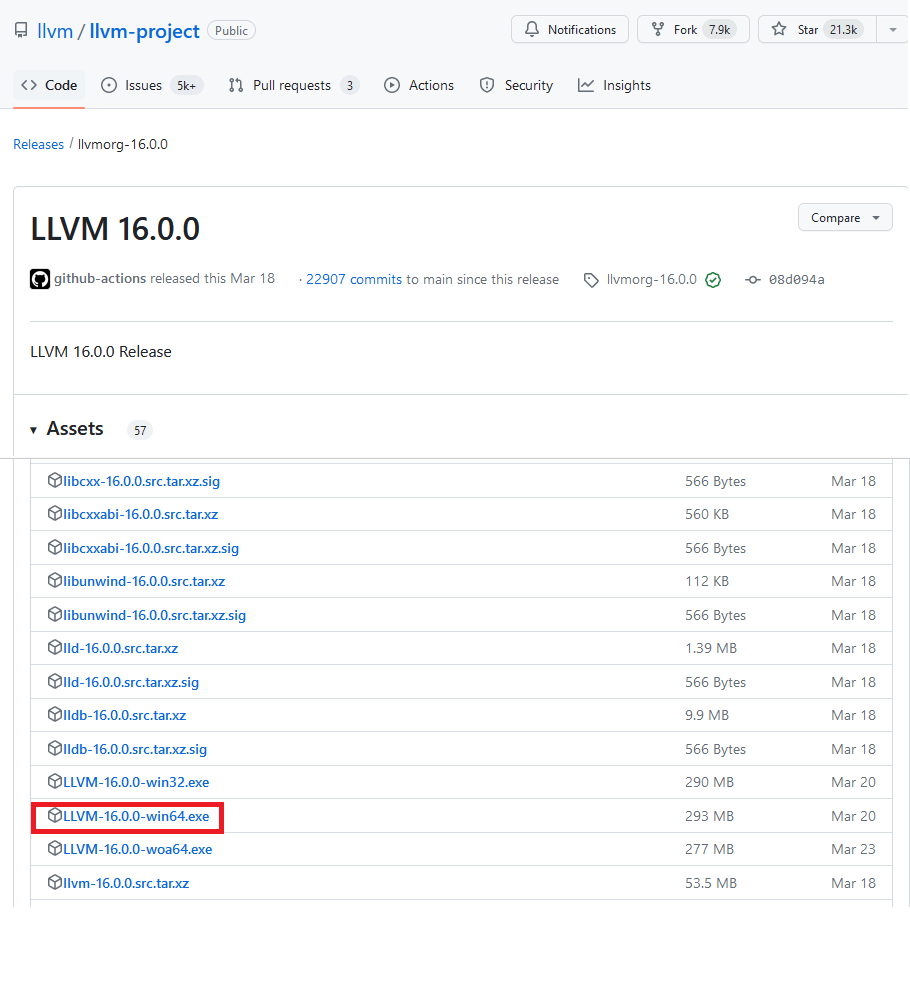

# clang-tidy examples

## 1. 目的
[clang-tidy](https://clang.llvm.org/extra/clang-tidy/) 是一个静态检查工具： 在真正的编译动作执行前， 执行代码扫描， 扫描有默认的规则也可以由用户自行指定规则。检查的结果通常是 bug 或潜在 bug（主要）， 也可以是命名风格方面的问题（目前个人用的较少）。

## 2. 与其他工具的比较

- ASAN (AddressSanitizer)
    - ASAN 是排查内存错误的一大利器，需要将代码重新编译、重新链接。在涉及多个闭源的库文件时，协调人力提供开启了ASAN的库，有时候很低效（沟通问题）
    - 要使用 ASAN, 可在 CMakeLists.txt 中 include([asan.cmake](https://github.com/zchrissirhcz/cmake_examples/blob/main/tools/asan.cmake))
- overlook.cmake
    - [overlook.cmake](https://github.com/zchrissirhcz/overlook/blob/main/overlook.cmake) 通过提升编译器的 warning 为 error， 实现了编译阶段的更安全的检查。 而 clang-tidy 过程则是编译过程之外的一个过程， 依赖于提前生成好的 compile_commands.json 文件。
    - 在没有使用 clang-tidy 的情况下， overlook.cmake 已经能够应对大多数情况

## 3. 使用 clang-tidy

安装 [LLVM](https://github.com/llvm/llvm-project/releases/tag/llvmorg-16.0.0) 套件， 里面提供了 clang-tidy 可执行程序， 并放到 PATH 中:




### 命令行: 单个源代码的检查
```bash
clang-tidy hello.cpp
```

### 命令行: 多个源代码的检查
```bash
clang-tidy hello.cpp world.cpp
```

### 工程中: 生成 compile_commands.json 并执行检查
```bash
cd ~/work/your_project
cmake -S . -B build
clang-tidy -p build ./src/hello.cpp ./src/world.cpp
```
其中生成 compile_commands.json 的方法：
- Linux/MacOS:
    - 方法1: `.bashrc/.zshrc`: `CMAKE_EXPORT_COMPILE_COMMANDS=1`
    - 方法2: CMakeLists.txt 中， `set(CMAKE_EXPORT_COMPILE_COMMANDS ON)`
    - 方法3: cmake configure 阶段，命令行传入参数 `-DCMAKE_EXPORT_COMPILE_COMMANDS=ON`
- Windows:
    - 安装 Clang Power Tools， 在 VS 工程打开后， 菜单里生成 compile_commands.json

### Visual Studio 2022 - 自带的 Code Analysis 中的 Clang-Tidy
可以通过手动在 project -> property -> Code Analysis 中开启 Clang-Tidy:


执行**重新生成**， 触发 clang-tidy 检查：


### Visual Studio - Clang Power Tools 插件
Clang Power Tools 是一个第三方扩展， 个人觉得更好用一些, 原因是能够生成 `compile_commands.json` 文件， 能提供给 clangd 等其他工具使用。

需要先安装扩展:


然后在工程中使用：


查看 tidy 结果, 并修改对应代码:


### 在 CMakeLists.txt 里集成 clang-tidy
```cmake
# download from https://github.com/zchrissirhcz/cmake_examples/blob/main/tools/clang-tidy.cmake
include(clang-tidy.cmake) # 引入工具

add_executable(hello
  hello.cpp
  world.cpp
)

cvpkg_apply_clang_tidy(hello) # 绑定到target上，在target编译前会插入 clang-tidy 检查
```

### 在 VSCode 中使用
下载安装 clang-tidy 插件。 可以配置为每次保存代码文件时都执行 clang-tidy 检查。

## 4. clang-tidy examples 使用方法
每个目录是一个具体的检查规则的实例代码， 大部分配有 `.clang-tidy` 文件。

对于命令行用户， 直接进入目录执行 `clang-tidy main.cpp` 即可。

对于希望收集 `.clang-tidy` 中检查项的用户， 拷贝 `.clang-tidy` 中的内容即可。

## 5. clang-tidy 没检查到 warning / error?
Clang-tidy 官方认为有些检查规则确定是正确的， 有些检查规则是概率性正确（可能有误报）。确定性的这些规则是默认开启的， 其他检查规则则默认没有开启。这就导致会出现：给定一个 main.cpp 代码， 执行 `clang-tidy main.cpp` 命令， 在不提供、提供 .clang-tidy 文件的两种情况下， 可能出现前者不报告warning/error， 后者报告 warning/error的情况。

通常可以结合 cppcoreguideline 等规则进行辅助搜索, 从 clang-tidy 官方文档找到规则后， 自行验证:
```bash
clang-tidy main.cpp "-checks=xxxx"
```
然后再放入 `.clang-tidy` 文件中

## 6. 用 clang-tidy 执行命名检查
- [identifier_naming](identifier_naming/README.md)

## 7. 在 .h 文件上执行 clang-tidy 检查
- [lint_on_dot_h_files](lint_on_dot_h_files/README.md)